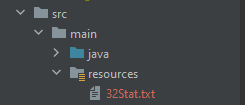

https://github.com/apohllo/obiektowe-lab/tree/master/proj1

Welcome to the world of evolution!

As a user you can:

➣ start and stop both simulations

➣ mark animals with dominant genotype (if it exists  and simulation is stopped)

➣ save average statistics to .txt file (when simulation is stopped)

➣ start tracking animal (just click them when simulation is stopped) or stop tracking (click one more time)

Color of the pigs indicates their energy level:

